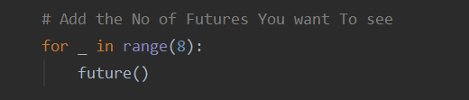

# *2048   BOT*

  

To Watch The Bot in Action  [Click Hear](https://www.linkedin.com/feed/update/urn:li:activity:6695681019619639296/)

 

***
 

### *ABOUT GAME*
 

***
2048 is a popular single-player game for Web and mobile. It's a type of “sliding block puzzle” — think Threes!, on which 2048 is based, or the old-timey game 
klotski — that's played on an almost Sudoku-like grid. ... **<ul>The object 
of the game is to combine the numbers displayed on the tiles until you reach 2048.</ul>**

 

***

 

### *BOT ALGORITHM* 

 

def get(l):

    hsum = 0
    hsize=0
    for e in l:
        if e !=0:
            hsize=hsize+1
    i=0
    while(i<=4):
        for j in range(i+1,rows):

            if (l[i]==l[j]) or (l[j]==0 ):
                if l[j]==0:
                    continue
                else:
                    hsum=hsum+2*l[i]
                    hsize=hsize-1
                    i=j
                    break
            elif (l[i]!=l[j]):
                break
        i=i+1
    return [hsize,hsum]

def HVV(l):

    h_score=0
    h_size=0

    for i in range(rows):
        a=get(l[i])
        h_score=a[1]+h_score
        h_size=h_size+a[0]

    return h_size+1

def future():

    global L2,L3

    if random.choice([1,2])==1:
        L2=right1(L2,rows,0)
    else:
        L2=left1(L2,rows,0)

    if random.choice([3,4])==3:
        L3=up1(L3,rows,0)
    else:
        L3=down1(L3,rows,0)

***

  

## *HOW THE BOT WORK'S*

 

 This Algorithm Basically Takes in the values in the 
 Present GAME State and then It Plyes in the Background to  gets the best 
 Possible Move Which will Minimize the Size Of the Game (Basically Increase the 
 Score ) But it have a drawback that there are many Possible move which 
 will Minimize the Game But  many a times Separates the Possibles Paires
 due to Which we will Not Get the Best Possible Score .
 
  
 
 #### *Future Algo Function*
 ***
 
 Hence To Overcome This We Further see the Future of the Future itself
 This Future Sacking Algo could see as many possibility as you Want to see,
 it will Just Make it Computationally Heavy .
 
 ***
 
 
 
 ***
 
 Here In Above Image 8 Basically  Means That the Algo
 Has Computed  The Best Possible Move After Looking at the Game State which is 8 Gen Ahead of The 
 Present Game State.
 
 
 * Though We are Looking Into The Future of The of Particular Game State
 State Still there is Always Uncertainty in the Perfect Move Calculation
 Since we cannot predict The position and the Number itself which will
 be Pooping in the Future States.
 
 ***
 
 ##### *Fun Part*
 
 If We will Run the Bot after Setting the future value to some Bigger Numbers
 Like 50 or 100 it can Even Get up to Somewhere near to 10,000 or so.
 >**In The Original 2048 This Will not Be Possible Because in it the Probability Of
>4 poping up is just 10% But in this Game I had Given 50% Chance for Both 
>2 and 4 to POP up.**
  
 
   
